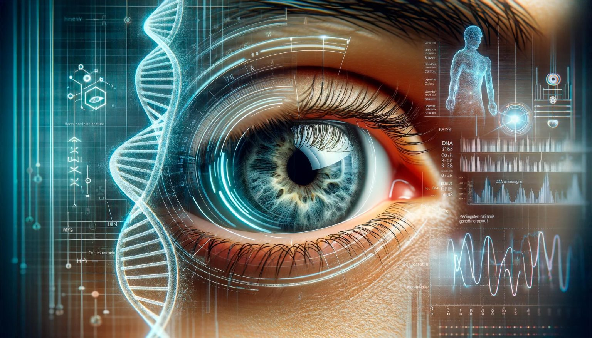
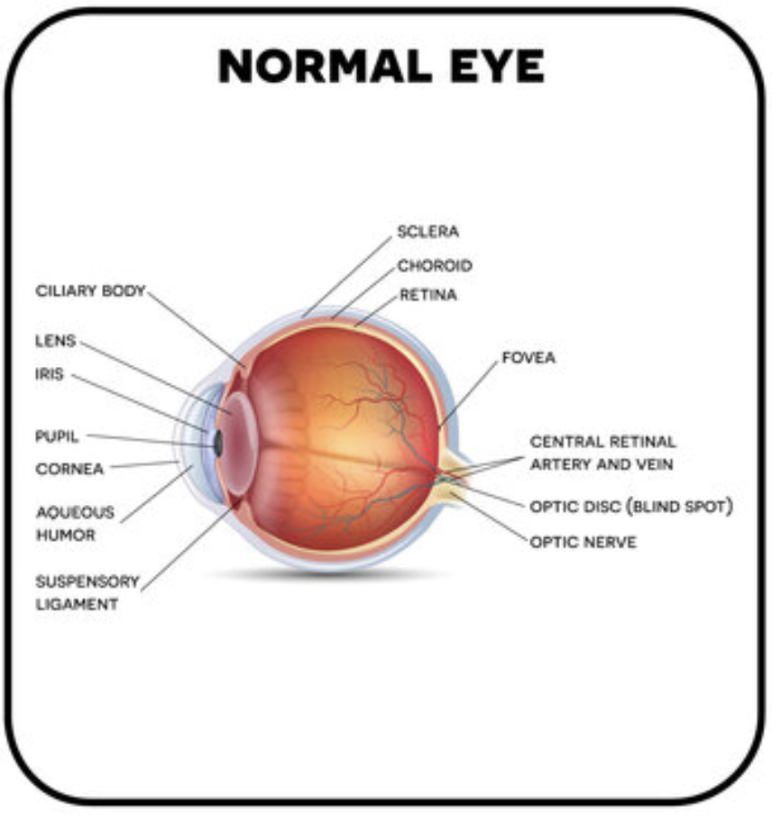
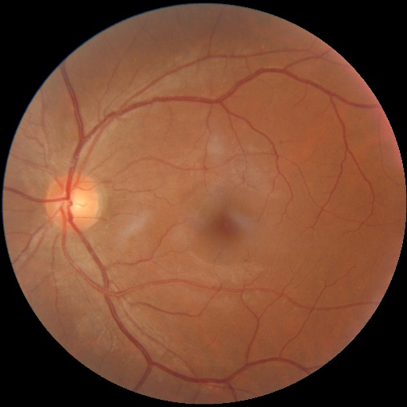
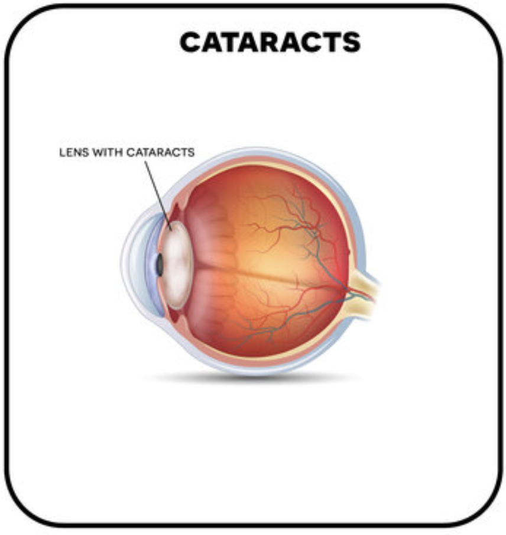
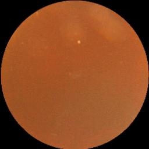
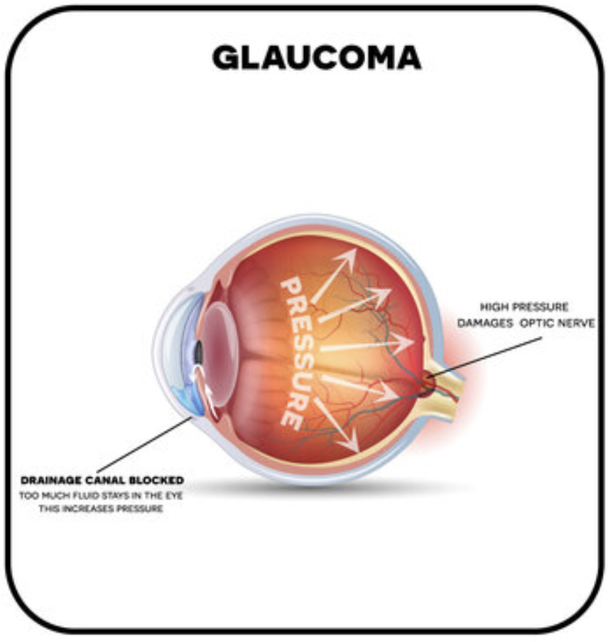
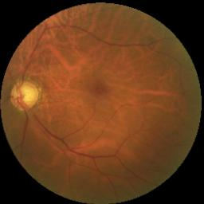
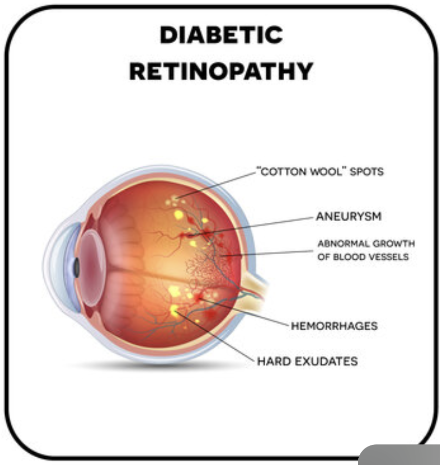
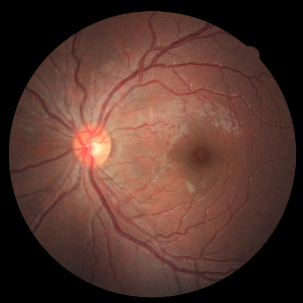

# Retinal Imaging

## Data Science in Health

#### Gérome Laurin Meyer | Rebekka von Wartburg

#### June 17, 2024

##  [1]

## Introduction

Over two billion people worldwide suffer from vision loss due to an eye disease [2]. Some of these losses can be irreversible. Timely intervention or early detection can slow down the damage process, preserve vision and generally improve the quality of life of those affected.
However, early detection of eye diseases is difficult, as they are often asymptomatic in the early stages. Ophthalmologists, specialists in the detection of eye diseases, use various diagnostic instruments to examine eye diseases, such as slit lamps, tonometry, perimetry, gonioscopy, pachymetry and fundoscopy.

Funduscopy offers a simple and cost-effective screening solution. It uses a camera to illuminate the pupil of the eye, collects the reflected light from the retinal surface and captures it using imaging optics to create a retinal image on a detector screen. This creates a 2D image of the retina.

In this project, the application of a Convolutional Neural Networks (CNNs) on funduscopy images for the classification of three major eye diseases - **cataract**, **glaucoma** and **retinopathy** - is investigated. These diseases are among the most common causes of visual impairment and blindness [3].

**Normal Eye:**

 
[4][5]

A healthy eye has a clear lens and an undamaged retina. This allows light to be focused correctly and ensures sharp vision. The normal function of the eye allows light to be directed through the lens onto the retina, where images are processed and sent to the brain via the optic nerve [3].

**Cataract:**

 | 
[4][5]

A cataract is a clouding of the lens that is often age-related, but can also occur with untreated diabetes mellitus and smoking. Symptoms include blurred vision (the eye loses the ability to focus), difficulty seeing at night and sensitivity to glare [3].

**Glaucoma:**

| 
[4][5]

Glaucoma is an eye disease in which the optic nerve is damaged, which in the worst case can lead to blindness. Glaucoma typically causes no symptoms at first, which makes early diagnosis difficult. Over time, peripheral vision loss can occur, which often goes unnoticed until the damage is significant. Risk factors include advanced age, a family history of glaucoma, elevated intraocular pressure [3].

**Retinopathy:**

 | 
[4][5]

Retinopathy is a disease of the retina, the light-sensitive tissue at the back of the eye. It is often associated with diabetes and can damage the blood vessels in the retina, which can result in vision loss or even blindness if left untreated [3].

## Data

The images in the dataset, which we obtained from kaggle [5], are funduscopy images, which are divided into the categories **Normal**, **Glaucoma**, **Cataract** and **Diabetic Retinopathy**.
Each of these categories contains up to two images per patient (left and right eye).
The following table shows the distribution of the data in the individual categories. The "2 images" column describes how many of the patients contain two images, the remaining only have a single image.

| Condition            | Files      | Patient IDs | 2 Images |
| -------------------- | ---------- | ----------- | -------- |
| Normal               | 1074 Files | 605         | 469      |
| Glaukoma             | 1007 Files | 699         | 302      |
| Cataract             | 1038 Files | 693         | 312      |
| Diabetic Retinopathy | 1098 Files | 549         | 549      |

#### Preprocessing

In order to prepare the images for CNN training, several preprocessing steps are performed:

1. **Resizing:**

- All images have at least a resolution of 512 x 512 pixels. Those that are larger will be downsized to 512 x 512.

2. **Empty Images**

- For patients with only one image, an empty second image is generated consisting of zeros in all pixels.

3. **Creating 5 Folds**

- For cross-validation, five folds are created to be used for cross-validation.

3. **Splitting data:**

- For each fold, the data is split into training and validation sets with 80% training data (3374 images) and 20% validation data (843 images).

The images are not augmented in other ways (such as random rotations), since fundoscopies should always return images in the same orientation and style.
However, some images are cropped and others are not. An approach to cropping all images in the same manner was evaluated, but did not result in any meaningful impact to performance
and was therefore removed again.

## Methods

We used two different approaches to this problem. Initially, all images were classified individually. However, this might leak information from the training data into the validation set.
Instead, splitting the data by patients ensures that a model has never seen the other eye of a patient already during training, therefore improving the robustness of results.

The `SingleEyeClassifier` is a simple convolutional neural network (CNN) used to classify all images individually without splitting by patients.

The `DoubleEyeClassifier` consists of two separate CNNs. These create feature maps which are then used by a shared fully connected neural network to make the final prediction per patient.

The CNN architectures of both models are based on the encoder part of the U-Net Architecture, since it is a proven architecture for extracting features from medical images [7].

### SingleEyeClassifier

1. **Convolutional Layer:**

- The classifier consists of 6 layers, each comprising 2 convolutional layers, resulting in a total of 12 convolutional layers.
- The number of channels is doubled after each convolutional layer: from 3 (RGB) to 16, 32, 64, 128, 256 and finally 512.

2. **Pooling Layer:**

- After each convolution, a max-pooling operation is performed to reduce the spatial dimension and lower the computational cost.
- After the first two convolution layers, max-pooling with a kernel size of 4x4 is applied to quickly reduce the image size, thus shortening the training time and reducing memory requirements.
- After the further convolution layers, max-pooling with a kernel size of 2x2 is performed to further condense the representations without losing too much information.

3. **Fully Connected Layer:**

- The extracted features are then fed into a fully connected neural network:
  - 8192 input neurons
  - 4064 neurons in the first hidden layer
  - 256 neurons in the second hidden layer
  - 4 output neurons for classification

### DoubleEyeClassifier

1. **2 Convolutional Layers:**

- Similar to the `SingleEyeClassifier`, but there are now two processing each eye of the patient separately.

2. **Concatination:**

- The resulting feature maps of the feature extractors are flattened and merged to be processed by the fully connected layer.
  The DoubleEyeClassifier takes two images as input. It consists of two separate feature extractors that extract features from each input image. The extracted features are then merged and fed into a neural network.

1. **Left Feature Extractor and Right Feature Extractor:**

- **Convolutional Layer:** 6 layers with 2 convolutional layers each, 12 convolutional layers in total Number of channels increases as follows: 3 (RGB)to 16, 32, 64, 128, 256, 512 and finally 1024.

- **Pooling layer:** After the first two layers: Max pooling with kernel size 4x4; After the following layers: Max pooling with kernel size 2x2

- **Fully Connected Layer:** Flattening layer for converting the features into a one-dimensional vector

3. **Fully Connected Layer:**

- The extracted features are then fed into a fully connected neural network:
  - 8192 input neurons
  - 2048 neurons in the first hidden layer
  - 1024 neurons in the second hidden layer
  - 512 neurons in the third hidden layer
  - 256 neurons in the fourth hidden layer
  - 4 output neurons for classification

## Model Training

The configurations made to train and evaluate our model are described in **Configurations**, while training our model is described in **Training Steps** and its evaluation in **Model Evaluation Metric**.

### Configurations

The configurations that are used for training are defined in `Configuration.py`. In development mode `(DEV_MODE)` 3 epochs are trained, while in effective training 20 epochs are performed.

The training hyperparameters include 20 epochs for training ` (NUMBER_OF_EPOCHS_TRAINING)` and 3 epochs for testing `(DEV_MODE)``(NUMBER_OF_EPOCHS_TESTING)`, as well as batch sizes of 110 for training `(BATCH_SIZE_TRAINING)` and 3 for testing `(BATCH_SIZE_TESTING)`. When using multiple GPUs, a batch size of 512 `(MULTI_GPU_BATCH_SIZE)` is used. The learning rate `(LEARNING_RATE)` is 1e-4 and is reduced by a factor of 0.1 `(LEARNING_RATE_FACTOR)` after 2 epochs without optimization `(LEARNING_RATE_EPOCH_PATIENCE)`.

Names and tags are defined for the experiment, the project, the entity, the architecture and the data set. These help to manage the experiments. Data and models are stored in the specified directories `(DATA_PATH, MODEL_SAVE_PATH)`.

The classification indices `(CLASS_INDICES)` for different categories of our dataset are also defined

Additional dynamic properties such as `RUN_NAME`, `NUMBER_OF_EPOCH` and `BATCH_SIZE` adapt depending on the mode `(DEV_MODE)` and the number of GPUs used `(NUMBER_OF_GPUS)`

### Training Steps

TODO

### Model Evaluation Metric

- The performance of the model is evaluated with Multiclass Accuracy (from Torchmetrics), as the four classes are sufficiently balanced.
- Finally, the model is saved on Weights & Biases so that it can be used for predictions of unlabeled images.

## Results


Both approaches achieve similar results, though the Single Eye Classifier was not cross-validated on multiple folds, due to time constraints.

| Model                 | Validation Accuracy | Training Loss   |
| --------------------- | ------------------- | --------------- |
| Single Eye Classifier | 0.8577              | 0.1082          |
| Double Eye Classifier | 0.8386 ± 0.0186     | 0.0079 ± 0.0025 |

## Installation

In order to run the code in this project create a virtual environment and install the package:

```shell
python3 -m venv venv
source venv/bin/activate
pip install -e .
```

The implementation also contains a `Dockerfile`, which can be used on machines with NVIDIA GPUs for training and supports multi-GPU training.
To use this, run the commands below.

You will need to have docker and Nvidia's container-toolkit installed:

1. https://docs.docker.com/engine/install/
2. https://docs.nvidia.com/datacenter/cloud-native/container-toolkit/latest/install-guide.html

```shell
docker build -t retina-classifier-trainer:latest .
# Remove the --gpus=all flag if you want to test training on CPU:
docker run -it --gpus=all retina-classifier-trainer
```

## Related Work

To address the global prevalence of eye diseases, numerous studies have investigated the classification of different eye diseases [6]. In order to make our developed best CNN comparable with existing studies, we used studies that perform multiclassification predictions as well as those that focus specifically on individual eye diseases. In addition, we also included approaches that are not based on CNNs.

The results of these analyses are shown in the table below:

<table border="1">
  <tr>
    <th>Disease</th>
    <th>Study</th>
    <th>Approach</th>
    <th>Accuracy</th>
    <th>Ours</th>
  </tr>
  <tr>
    <td rowspan="3"><strong>Multiclass</strong></td>
    <td><em>Khan et al. (2019)</em> [8]​ <br> An Automatic Ocular Disease Detection Scheme from Enhanced Fundus Images Based on Ensembling Deep CNN Networks <a href="https://ieeexplore.ieee.org/abstract/document/9393050">Link</a></td>
    <td>CNN</td>
    <td>86.00%</td>
    <td rowspan="3" style="color: red"><strong>86.9%</strong></td>
  </tr>
  <tr>
    <td><em>Glaret et al. (2022)</em> [9]​ <br>Optimized convolution neural network based multiple eye disease detection <a href="https://doi.org/10.1016/j.compbiomed.2022.105648">Link</a></td>
    <td>CNN</td>
    <td>98.3%</td>
  </tr>
  <tr>
    <td><em>Gour et al. (2021)</em> [10]​ <br> Multi-class multi-label ophthalmological disease detection using transfer  learning based convolutional neural network <a href="https://doi.org/10.1016/j.bspc.2020.102329">Link</a></td>
    <td>CNN</td>
    <td>89.06%</td>
  </tr>
  <tr>
    <td rowspan="4"><strong>Claucoma</strong></td>
    <td><em>Raghavendra et al. (2018)</em> [11]  <br>​ Deep convolution neural network for accurate diagnosis of glaucoma using digital fundus images <a href="https://doi.org/10.1016/j.ins.2018.01.051">Link</a></td>
    <td>CNN</td>
    <td>98.13%</td>
    <td rowspan="4" style="color: red"><strong>88.8%</strong></td>
  </tr>
  <tr>
    <td><em>Dias-Pinto et al. (2019)</em> [12] <br>​ CNNs for automatic glaucoma assessment using fundus images: an extensive validation <a href="https://biomedical-engineering-online.biomedcentral.com/articles/10.1186/s12938-019-0649-y">Link</a></td>
    <td>CNN <em>(with different ImageNet trained models)</em></td>
    <td>96.05%</td>
  </tr>
  <tr>
    <td><em>Shoba et al. (2020) </em> [13]​ <br>Detection of glaucoma disease in fundus images based on morphological operation and finite element method <a href="https://doi.org/10.1016/j.bspc.2020.101986">Link</a></td>
    <td>SVM</td>
    <td>94.86%</td>
  </tr>
  <tr>
    <td><em>Septiarini et al. (2018)</em> [14]<br>​ Automatic Glaucoma Detection Method Applying a Statistical Approach to Fundus Images <a href="https://e-hir.org/journal/view.php?id=10.4258/hir.2018.24.1.53">Link</a></td>
    <td>KNN</td>
    <td>95.24%</td>
 </tr>
  <tr>
    <td rowspan="3"><strong>Cataract</strong></td>
    <td><em>Zhang et al. (2017)</em> [15] <br>​ Automatic cataract detection and grading using Deep Convolutional Neural Network <a href="https://doi.org/10.1109/ICNSC.2017.8000068">Link</a></td>
    <td>CNN</td>
    <td>93.52%</td>
    <td rowspan="3" style="color: red"><strong>93.1%</strong></td>
  </tr>
  <tr>
    <td><em>Ran et al. (2018)</em> [16]<br>​ Cataract Detection and Grading Based on Combination of Deep Convolutional Neural Network and Random Forests <a href="https://doi.org/10.1109/ICNIDC.2018.8525852">Link</a></td>
    <td>CNN <em>(with Random Forest)</em></td>
    <td>90.69%</td>
  </tr>
  <tr>
    <td><em>Zhou et al. (2020)</em>​ [17] <br> Automatic Cataract Classification Using Deep Neural Network With Discrete State Transition <a href="https://doi.org/10.1109/TMI.2019.2928229">Link</a></td>
    <td>Deep NN</td>
    <td>94.00%</td>
  </tr>
  <tr>
    <td rowspan="3"><strong>Diabetic Retinopathy</strong></td>
    <td><em>Mohsin Butt et al. (2019)</em> [18]<br> Multi-channel Convolutions Neural Network Based Diabetic Retinopathy Detection from Fundus Images <a href="https://doi.org/10.1016/j.procs.2019.12.110">Link</a></td>
    <td>CNN</td>
    <td>97.08%</td>
    <td rowspan="3" style="color: red"><strong>96.4%</strong></td>
  </tr>
  <tr>
    <td><em>Li et al. (2019)</em> [19]​ <br> Computer-Assisted Diagnosis for Diabetic Retinopathy Based on Fundus Images Using Deep Convolutional Neural Network <a href="https://www.hindawi.com/journals/misy/2019/6142839/">Link</a></td>
    <td>CNN</td>
    <td>91.05%</td>
  </tr>
  <tr>
    <td><em>Saleh et al. (2018) </em> ​[20] <br> Learning ensemble classifiers for diabetic retinopathy assessment <a href="https://doi.org/10.1016/j.artmed.2017.09.006">Link</a></td>
    <td>Ensemble Classifier</td>
    <td>72.84%</td>
  </tr>
</table>

## Discussion

TODO

## Sources

[1] Massachusetts Eye and Ear Infirmary, 'Unlocking the Future of Health: Predicting Disease With Retinal Imaging and Genetics,' SciTechDaily, 07-Feb-2024. [Online]. Available: https://scitechdaily.com/unlocking-the-future-of-health-predicting-disease-with-retinal-imaging-and-genetics/. [Accessed: 16-May-2024].

[2] World Health Organization, 'Blindness and vision impairment,' WHO, [Online]. Available: https://www.who.int/news-room/fact-sheets/detail/blindness-and-visual-impairment. [Accessed: 16-May-2024].

[3] National Eye Institute, 'Eye Conditions and Diseases,' National Eye Institute, [Online]. Available: https://www.nei.nih.gov/learn-about-eye-health/eye-conditions-and-diseases. [Accessed: 16-May-2024].

[4] Atlantic Eye Institute, 'Diabetic Eye Issues: 5 Ways Diabetes Impacts Vision,' Atlantic Eye Institute, 18-Oct-2021. [Online]. Available: https://atlanticeyeinstitute.com/diabetic-eye-issues-5-ways-diabetes-impacts-vision/. [Accessed: 16-May-2024].

[5] A. Basandrai, "Medical Scan Classification Dataset," Kaggle, 2023. [Online]. Available: https://www.kaggle.com/datasets/arjunbasandrai/medical-scan-classification-dataset. [Accessed: 16-May-2024].

[6] J. Sanghavi and M. Kurhekar, "Ocular disease detection systems based on fundus images: A survey," Multimedia Tools and Applications, vol. 83, pp. 21471-21496, 2024. doi: 10.1007/s11042-023-16366-x.

[7] O. Ronneberger, P. Fischer, und T. Brox, „U-Net: Convolutional Networks for Biomedical Image Segmentation,” International Conference on Medical Image Computing and Computer-Assisted Intervention, vol. abs/1505.04597, 2015. doi: 10.1007/978-3-319-24574-4_28.

[8] I. A. Khan, FNU Asaduzzaman, and S. A. Fattah, "An Automatic Ocular Disease Detection Scheme from Enhanced Fundus Images Based on Ensembling Deep CNN Networks," in Proc. International Conference on Electrical and Computer Engineering (ICECE), 2020. doi: 10.1109/ICECE51571.2020.9393050.

[9] P. Glaret subin and P. Muthukannan, "Optimized convolution neural network based multiple eye disease detection," Computers in Biology and Medicine, vol. 146, 2022. doi: 10.1016/j.compbiomed.2022.105648.

[10] N. Gour and P. Khanna, "Multi-class multi-label ophthalmological disease detection using transfer learning based convolutional neural network," Biomedical Signal Processing and Control, vol. 66, 2021. doi: 10.1016/j.bspc.2020.102329.

[11] U. Raghavendra, H. Fujita b, S. V Bhandary, A. Gudigar, T. Jen Hong, U. Rajendra Acharya, "Deep convolution neural network for accurate diagnosis of glaucoma using digital fundus images," Information Sciences, vol. 441, pp. 41-49, 2018. doi: 10.1016/j.ins.2018.01.051.

[12] A. Diaz-Pinto, S. Morales, V. Naranjo, T. Köhler, J. M. Mossi, and A. Navea, "CNNs for automatic glaucoma assessment using fundus images: An extensive validation," BioMedical Engineering OnLine, vol. 18, no. 29, Mar. 2019. doi: 10.1186/s12938-019-0649-y.

[13] S.J. Grace Shoba, A. Brintha Therese, "Detection of glaucoma disease in fundus images based on morphological operation and finite element method," Biomedical Signal Processing and Control, vol. 62, 2020. doi: 10.1016/j.bspc.2020.101986.

[14] A. Septiarini, D. M. Khairina, A. H. Kridalaksana, and H. Hamdani, "Automatic Glaucoma Detection Method Applying a Statistical Approach to Fundus Images," Healthcare Informatics Research, vol. 24, no. 1, pp. 53-60, Jan. 2018. doi: 10.4258/hir.2018.24.1.53.

[15] Linglin Zhang et al., "Automatic cataract detection and grading using Deep Convolutional Neural Network," 2017 IEEE 14th International Conference on Networking, Sensing and Control (ICNSC), Calabria, pp. 60-65, 2017. doi: 10.1109/ICNSC.2017.8000068.

[16] J. Ran, K. Niu, Z. He, H. Zhang and H. Song, "Cataract Detection and Grading Based on Combination of Deep Convolutional Neural Network and Random Forests," 2018 International Conference on Network Infrastructure and Digital Content (IC-NIDC), Guiyang, China, pp. 155-159, 2018. doi: 10.1109/ICNIDC.2018.8525852.

[17] Y. Zhou, G. Li and H. Li, "Automatic Cataract Classification Using Deep Neural Network With Discrete State Transition," in IEEE Transactions on Medical Imaging, vol. 39, no. 2, pp. 436-446, Feb. 2020. doi: 10.1109/TMI.2019.2928229.

[18] M. Mohsin Butt, G. Latif, D.N.F. Awang Iskandar, J. Alghazo, A. H. Khan, "Multi-channel Convolutions Neural Network Based Diabetic Retinopathy Detection from Fundus Images," Procedia Computer Science, vol. 163, pp. 283-291, 2019. doi: 10.1016/j.procs.2019.12.110.

[19] Y.-H. Li, N.-N. Yeh, S.-J. Chen, and Y.-C. Chung, "Computer-Assisted Diagnosis for Diabetic Retinopathy Based on Fundus Images Using Deep Convolutional Neural Network," Mobile Information Systems, vol. 2019, Jan. 2019. doi: 10.1155/2019/6142839

[20] E. Saleh, J. Błaszczyński, A. Moreno, A. Valls, P. Romero-Aroca, S. de la Riva-Fernández, R. Słowiński, "Learning ensemble classifiers for diabetic retinopathy assessment," Artificial Intelligence in Medicine, vol. 85, 2018. doi: 10.1016/j.artmed.2017.09.006.
