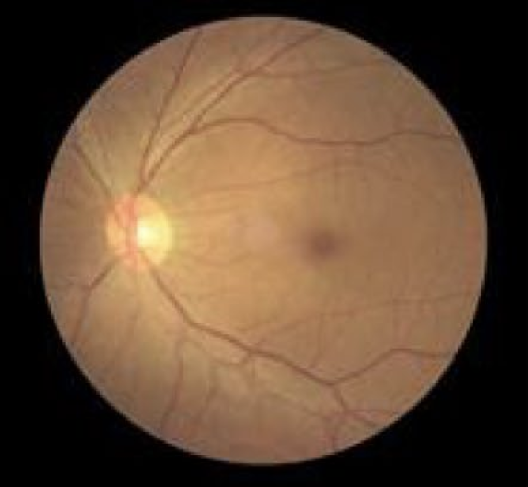
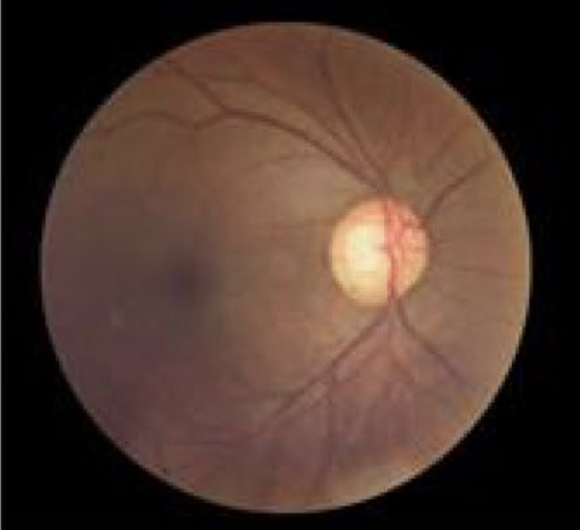
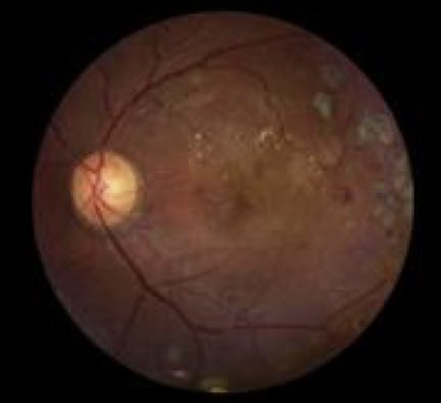

# Retinal Imaging
## Medical Image Classification
### Data Science in Health
#### Gérome Laurin Meyer | Rebekka von Wartburg
#### May 24, 2024
 [1]

---

## Introduction
Over two billion people worldwide suffer from vision loss due to an eye disease [2]. Some of these losses can be irreversible. Timely intervention or early detection can slow down the damage process, preserve vision and generally improve the quality of life of those affected.
However, early detection of eye diseases is difficult, as they are often asymptomatic in the early stages. Ophthalmologists, specialists in the detection of eye diseases, use various diagnostic instruments to examine eye diseases, such as slit lamps, tonometry, perimetry, gonioscopy, pachymetry and fundoscopy.

Funduscopy offers a simple and cost-effective screening solution. It uses a camera to illuminate the pupil of the eye, collects the reflected light from the retinal surface and captures it using imaging optics to create a retinal image on a detector screen. This creates a 2D image of the retina.

In this project, the application of a Convolutional Neural Networks (CNNs) on funduscopy images for the classification of three major eye diseases - **cataract**, **glaucoma** and **retinopathy** - is investigated. These diseases are among the most common causes of visual impairment and blindness [4]. 

**Normal Eye:**

 | 
[3][5]

A healthy eye has a clear lens and an undamaged retina. This allows light to be focused correctly and ensures sharp vision. The normal function of the eye allows light to be directed through the lens onto the retina, where images are processed and sent to the brain via the optic nerve [4]. 

**Cataract:**

 | 
[3][5]

A cataract is a clouding of the lens that is often age-related, but can also occur with untreated diabetes mellitus and smoking. Symptoms include blurred vision (the eye loses the ability to focus), difficulty seeing at night and sensitivity to glare [4]. 

**Glaucoma:**

| 
[3][5]

Glaucoma is an eye disease in which the optic nerve is damaged, which in the worst case can lead to blindness. Glaucoma typically causes no symptoms at first, which makes early diagnosis difficult. Over time, peripheral vision loss can occur, which often goes unnoticed until the damage is significant.  Risk factors include advanced age, a family history of glaucoma, elevated intraocular pressure [4].

**Retinopathy:**

 | 
[3][5]

Retinopathy is a disease of the retina, the light-sensitive tissue at the back of the eye. It is often associated with diabetes and can damage the blood vessels in the retina, which can result in vision loss or even blindness if left untreated [4].

## Install Guide
TODO

## Data Description & Structure Analysis

### Content
The images in the dataset, which we obtained from kaggle [6], are funduscopy images, which are divided into the following categories:

* *Cataract:* 1038 Files​

* *Diabetic Retinopathy:* 1098 Files​

* *Glaukoma:* 1007 Files​

* *Normal:* 1074 Files

### Structure

## Data Preprocessing
Um die Bilder für das Training des CNN vorzubereiten, werden verschiedene Preprocessing-Schritte durchgeführt:
1. **Resizing the images to uniform dimensions:**

*  The images are loaded first. Most of them are available with a resolution of 512 x 512 pixels. Those that are larger will be resized to 512 x 512. This ensures that no important information is lost and that the images are not distorted despite the reduction in resolution.

1. **Splitting data:**
* The data is split into training and validation data with a split of 80% training data (3374 images) and 20% validation data (843 images).

## Model Architecture
Das CNN-Modell besteht aus mehreren Schichten:
1. **Convolutional Layer:** 
* 6 layers with 2 convolutions, resulting in a total of 12 convolutions
* This increases the number of channels after each convolution layer.
* The increase in the number of channels corresponds to x2: 3 (RGB) => 16 => 32 => 64 => 128 => 256 => 512

2. **Pooling Layer:**
* Max pooling is carried out after each convolution layer. This means that deeper layers have a larger receptive field and therefore contain more of the original image.
* After the first two convolution layers, max pooling is performed with kernel size 4. This reduces the size of the image so that the training phase does not take too long and the images fit into memory.
* After the other layers, max pooling is performed with kernel size 2 so that not too much information is lost.

3. **Fully Connected Layer:**
* Finally, the input is passed to a Fully Connected Neural Network with 8192 Input Neurons => 4064 Hidden => 256 Hidden => 4 Output

## Model Training
* NUMBER_OF_EPOCHS = 20
* BATCH_SIZE = 64
* LEARNING_RATE = 1e-5

## Model Performance
* The performance of the model is evaluated with Multiclass Accuracy (from Torchmetrics), as the four classes are sufficiently balanced.
* Finally, the model is saved on Weights & Biases so that it can be used for predictions of unlabeled images.

## Results
TODO

## Discussion
TODO

## Sources
[1] https://scitechdaily.com/unlocking-the-future-of-health-predicting-disease-with-retinal-imaging-and-genetics/

[2] World Health Organization (2021, February 26) Blindness and vision impairment. Retrieved June 10,
2021, from https://www.who.int/news-room/fact-sheets/detail/blindness-and-visual-impairment

[3] Sanghavi, J., Kurhekar, M. Ocular disease detection systems based on fundus images: a survey. Multimed Tools Appl 83, 21471–21496 (2024). https://doi.org/10.1007/s11042-023-16366-x

[4] https://www.nei.nih.gov/learn-about-eye-health/eye-conditions-and-diseases

[5] https://atlanticeyeinstitute.com/diabetic-eye-issues-5-ways-diabetes-impacts-vision/

[6] https://www.kaggle.com/datasets/arjunbasandrai/medical-scan-classification-dataset

