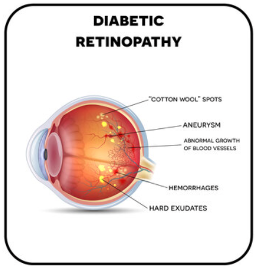

# Retinal Imaging
## Medical Image Classification
### Data Science in Health
#### Gérome Laurin Meyer | Rebekka von Wartburg
#### June 17, 2024
 [1]
---

## Installation
In order to run the code in this project create a virtual environment and install the package:
```shell
python3 -m venv venv
source venv/bin/activate
pip install -e .
```

## Introduction
Over two billion people worldwide suffer from vision loss due to an eye disease [2]. Some of these losses can be irreversible. Timely intervention or early detection can slow down the damage process, preserve vision and generally improve the quality of life of those affected.
However, early detection of eye diseases is difficult, as they are often asymptomatic in the early stages. Ophthalmologists, specialists in the detection of eye diseases, use various diagnostic instruments to examine eye diseases, such as slit lamps, tonometry, perimetry, gonioscopy, pachymetry and fundoscopy.

Funduscopy offers a simple and cost-effective screening solution. It uses a camera to illuminate the pupil of the eye, collects the reflected light from the retinal surface and captures it using imaging optics to create a retinal image on a detector screen. This creates a 2D image of the retina.

In this project, the application of a Convolutional Neural Networks (CNNs) on funduscopy images for the classification of three major eye diseases - **cataract**, **glaucoma** and **retinopathy** - is investigated. These diseases are among the most common causes of visual impairment and blindness [4]. 

**Normal Eye:**

  
[5][6]

A healthy eye has a clear lens and an undamaged retina. This allows light to be focused correctly and ensures sharp vision. The normal function of the eye allows light to be directed through the lens onto the retina, where images are processed and sent to the brain via the optic nerve [4]. 

**Cataract:**

 | 
[5][6]

A cataract is a clouding of the lens that is often age-related, but can also occur with untreated diabetes mellitus and smoking. Symptoms include blurred vision (the eye loses the ability to focus), difficulty seeing at night and sensitivity to glare [4]. 

**Glaucoma:**

| 
[5][6]

Glaucoma is an eye disease in which the optic nerve is damaged, which in the worst case can lead to blindness. Glaucoma typically causes no symptoms at first, which makes early diagnosis difficult. Over time, peripheral vision loss can occur, which often goes unnoticed until the damage is significant.  Risk factors include advanced age, a family history of glaucoma, elevated intraocular pressure [4].

**Retinopathy:**

 | 
[5][5]


Retinopathy is a disease of the retina, the light-sensitive tissue at the back of the eye. It is often associated with diabetes and can damage the blood vessels in the retina, which can result in vision loss or even blindness if left untreated [4].

## Related Work
To address the global prevalence of eye diseases, numerous studies have investigated the classification of different eye diseases [3]. In order to make our developed best CNN comparable with existing studies, we used studies that perform multiclassification predictions as well as those that focus specifically on individual eye diseases. In addition, we also included approaches that are not based on CNNs.

The results of these analyses are shown in the table below:

<table border="1">
  <tr>
    <th>Disease</th>
    <th>Study</th>
    <th>Approach</th>
    <th>Accuracy</th>
    <th>Ours</th>
  </tr>
  <tr>
    <td rowspan="3"><strong>Multiclass</strong></td>
    <td><em>Khan et al. (2019)</em> [7]​ <br> An Automatic Ocular Disease Detection Scheme from Enhanced Fundus Images Based on Ensembling Deep CNN Networks <a href="https://ieeexplore.ieee.org/abstract/document/9393050">Link</a></td>
    <td>CNN</td>
    <td>86.00%</td>
    <td rowspan="3" style="color: red"><strong>86.9%</strong></td>
  </tr>
  <tr>
    <td><em>Glaret et al. (2022)</em> [8]​ <br>Optimized convolution neural network based multiple eye disease detection <a href="https://doi.org/10.1016/j.compbiomed.2022.105648">Link</a></td>
    <td>CNN</td>
    <td>98.3%</td>
  </tr>
  <tr>
    <td><em>Gour et al. (2021)</em> [9]​ <br> Multi-class multi-label ophthalmological disease detection using transfer  learning based convolutional neural network <a href="https://doi.org/10.1016/j.bspc.2020.102329">Link</a></td>
    <td>CNN</td>
    <td>89.06%</td>
  </tr>
  <tr>
    <td rowspan="4"><strong>Claucoma</strong></td>
    <td><em>Raghavendra et al. (2018)</em> [10]  <br>​ Deep convolution neural network for accurate diagnosis of glaucoma using digital fundus images <a href="https://doi.org/10.1016/j.ins.2018.01.051">Link</a></td>
    <td>CNN</td>
    <td>98.13%</td>
    <td rowspan="3" style="color: red"><strong>88.8%</strong></td>
  </tr>
  <tr>
    <td><em>Dias-Pinto et al. (2019)</em> [11] <br>​ CNNs for automatic glaucoma assessment using fundus images: an extensive validation <a href="https://biomedical-engineering-online.biomedcentral.com/articles/10.1186/s12938-019-0649-y">Link</a></td>
    <td>CNN <em>(with different ImageNet trained models)</em></td>
    <td>96.05%</td>
  </tr>
  <tr>
    <td><em>Shoba et al. (2020) </em> [12]​ <br>Detection of glaucoma disease in fundus images based on morphological operation and finite element method <a href="https://doi.org/10.1016/j.bspc.2020.101986">Link</a></td>
    <td>SVM</td>
    <td>94.86%</td>
  </tr>
  <tr>
    <td><em>Septiarini et al. (2018)</em> [13]<br>​ Automatic Glaucoma Detection Method Applying a Statistical Approach to Fundus Images <a href="https://e-hir.org/journal/view.php?id=10.4258/hir.2018.24.1.53">Link</a></td>
    <td>KNN</td>
    <td>95.24%</td>
 </tr>
  <tr>
    <td rowspan="3"><strong>Cataract</strong></td>
    <td><em>Zhang et al. (2017)</em> [14] <br>​ Automatic cataract detection and grading using Deep Convolutional Neural Network <a href="https://doi.org/10.1109/ICNSC.2017.8000068">Link</a></td>
    <td>CNN</td>
    <td>93.52%</td>
    <td rowspan="3" style="color: red"><strong>93.1%</strong></td>
  </tr>
  <tr>
    <td><em>Ran et al. (2018)</em>  [15]<br>​ Cataract Detection and Grading Based on Combination of Deep Convolutional Neural Network and Random Forests <a href="https://doi.org/10.1109/ICNIDC.2018.8525852">Link</a></td>
    <td>CNN <em>(with Random Forest)</em></td>
    <td>90.69%</td>
  </tr>
  <tr>
    <td><em>Zhou et al. (2020)</em>​ [16] <br> Automatic Cataract Classification Using Deep Neural Network With Discrete State Transition <a href="https://doi.org/10.1109/TMI.2019.2928229">Link</a></td>
    <td>Deep NN</td>
    <td>94.00%</td>
  </tr>
  <tr>
    <td rowspan="3"><strong>Diabetic Retinopathy</strong></td>
    <td><em>Mohsin Butt et al. (2019)</em> [17]<br> Multi-channel Convolutions Neural Network Based Diabetic Retinopathy Detection from Fundus Images <a href="https://doi.org/10.1016/j.procs.2019.12.110">Link</a></td>
    <td>CNN</td>
    <td>97.08%</td>
    <td rowspan="3" style="color: red"><strong>96.4%</strong></td>
  </tr>
  <tr>
    <td><em>Li et al. (2019)</em> [18]​ <br> Computer-Assisted Diagnosis for Diabetic Retinopathy Based on Fundus Images Using Deep Convolutional Neural Network <a href="https://www.hindawi.com/journals/misy/2019/6142839/">Link</a></td>
    <td>CNN</td>
    <td>91.05%</td>
  </tr>
  <tr>
    <td><em>Saleh et al. (2018) </em> ​[19] <br> Learning ensemble classifiers for diabetic retinopathy assessment <a href="https://doi.org/10.1016/j.artmed.2017.09.006">Link</a></td>
    <td>Ensemble Classifier</td>
    <td>72.84%</td>
  </tr>
</table>


## Data Description & Structure Analysis

### Content
The images in the dataset, which we obtained from kaggle [6], are funduscopy images, which are divided into the categories **Normal**, **Glaucoma**, **Cataract** and **Diabetic Retinopathy**. Each of these categories contains up to two images per patient (left and right eye). The following table shows the distribution of the data in the individual categories as well as the distribution of images of the left and right eye within these categories.

| Condition            | Files       | Patient IDs | Left   | Right  |
|----------------------|-------------|-------------|--------|--------|
| Normal               | 1074 Files  | xy  | xy | xy |
| Glaukoma             | 1007 Files  | xy  | xy | xy |
| Cataract             | 1038 Files  | xy  | xy | xy |
| Diabetic Retinopathy | 1098 Files  | xy  | xy | xy |


### Structure

## Data Preprocessing
Um die Bilder für das Training des CNN vorzubereiten, werden verschiedene Preprocessing-Schritte durchgeführt:
1. **Resizing the images to uniform dimensions:**

*  The images are loaded first. Most of them are available with a resolution of 512 x 512 pixels. Those that are larger will be resized to 512 x 512. This ensures that no important information is lost and that the images are not distorted despite the reduction in resolution.

1. **Splitting data:**
* The data is split into training and validation data with a split of 80% training data (3374 images) and 20% validation data (843 images).

## Model Architecture
Das CNN-Modell besteht aus mehreren Schichten:
1. **Convolutional Layer:** 
* 6 layers with 2 convolutions, resulting in a total of 12 convolutions
* This increases the number of channels after each convolution layer.
* The increase in the number of channels corresponds to x2: 3 (RGB) => 16 => 32 => 64 => 128 => 256 => 512

2. **Pooling Layer:**
* Max pooling is carried out after each convolution layer. This means that deeper layers have a larger receptive field and therefore contain more of the original image.
* After the first two convolution layers, max pooling is performed with kernel size 4. This reduces the size of the image so that the training phase does not take too long and the images fit into memory.
* After the other layers, max pooling is performed with kernel size 2 so that not too much information is lost.

3. **Fully Connected Layer:**
* Finally, the input is passed to a Fully Connected Neural Network with 8192 Input Neurons => 4064 Hidden => 256 Hidden => 4 Output

## Model Training
* NUMBER_OF_EPOCHS = 20
* BATCH_SIZE = 64
* LEARNING_RATE = 1e-5

## Model Evaluation Metric
* The performance of the model is evaluated with Multiclass Accuracy (from Torchmetrics), as the four classes are sufficiently balanced.
* Finally, the model is saved on Weights & Biases so that it can be used for predictions of unlabeled images.

## Results
TODO

## Discussion
TODO


## Sources
[1] Massachusetts Eye and Ear Infirmary, 'Unlocking the Future of Health: Predicting Disease With Retinal Imaging and Genetics,' SciTechDaily, 07-Feb-2024. [Online]. Available: https://scitechdaily.com/unlocking-the-future-of-health-predicting-disease-with-retinal-imaging-and-genetics/. [Accessed: 16-May-2024].

[2] World Health Organization, 'Blindness and vision impairment,' WHO, [Online]. Available: https://www.who.int/news-room/fact-sheets/detail/blindness-and-visual-impairment. [Accessed: 16-May-2024].

[3] J. Sanghavi and M. Kurhekar, "Ocular disease detection systems based on fundus images: A survey," Multimedia Tools and Applications, vol. 83, pp. 21471-21496, 2024. [Online]. Available: https://doi.org/10.1007/s11042-023-16366-x. [Accessed: 16-May-2024].

[4] National Eye Institute, 'Eye Conditions and Diseases,' National Eye Institute, [Online]. Available: https://www.nei.nih.gov/learn-about-eye-health/eye-conditions-and-diseases. [Accessed: 16-May-2024].

[5] Atlantic Eye Institute, 'Diabetic Eye Issues: 5 Ways Diabetes Impacts Vision,' Atlantic Eye Institute, 18-Oct-2021. [Online]. Available: https://atlanticeyeinstitute.com/diabetic-eye-issues-5-ways-diabetes-impacts-vision/. [Accessed: 16-May-2024].

[6] A. Basandrai, "Medical Scan Classification Dataset," Kaggle, 2023. [Online]. Available: https://www.kaggle.com/datasets/arjunbasandrai/medical-scan-classification-dataset. [Accessed: 16-May-2024].

[7] I. A. Khan, FNU Asaduzzaman, and S. A. Fattah, "An Automatic Ocular Disease Detection Scheme from Enhanced Fundus Images Based on Ensembling Deep CNN Networks," in Proc. International Conference on Electrical and Computer Engineering (ICECE), 2020, [Online]. Available: https://ieeexplore.ieee.org/abstract/document/9393050. [Accessed: 16-May-2024]

[8] P. Glaret subin and P. Muthukannan, "Optimized convolution neural network based multiple eye disease detection," Computers in Biology and Medicine, vol. 146, 2022. [Online]. Available: https://doi.org/10.1016/j.compbiomed.2022.105648. [Accessed: 16-May-2024].

[9] N. Gour and P. Khanna, "Multi-class multi-label ophthalmological disease detection using transfer learning based convolutional neural network," Biomedical Signal Processing and Control, vol. 66, 2021. [Online]. Available: https://doi.org/10.1016/j.bspc.2020.102329. [Accessed: 16-May-2024].

[10] U. Raghavendra, H. Fujita b, S. V Bhandary, A. Gudigar, T. Jen Hong, U. Rajendra Acharya, "Deep convolution neural network for accurate diagnosis of glaucoma using digital fundus images," Information Sciences, vol. 441, pp. 41-49, 2018. [Online]. Available: https://doi.org/10.1016/j.ins.2018.01.051. [Accessed: 16-May-2024].

[11] A. Diaz-Pinto, S. Morales, V. Naranjo, T. Köhler, J. M. Mossi, and A. Navea, "CNNs for automatic glaucoma assessment using fundus images: An extensive validation," BioMedical Engineering OnLine, vol. 18, no. 29, Mar. 2019. [Online]. Available: https://biomedical-engineering-online.biomedcentral.com/articles/10.1186/s12938-019-0649-y. [Accessed: 16-May-2024].

[12] S.J. Grace Shoba, A. Brintha Therese, "Detection of glaucoma disease in fundus images based on morphological operation and finite element method," Biomedical Signal Processing and Control, vol. 62, 2020. [Online]. Available: https://doi.org/10.1016/j.bspc.2020.101986. [Accessed: 16-May-2024].

[13] A. Septiarini, D. M. Khairina, A. H. Kridalaksana, and H. Hamdani, "Automatic Glaucoma Detection Method Applying a Statistical Approach to Fundus Images," Healthcare Informatics Research, vol. 24, no. 1, pp. 53-60, Jan. 2018. [Online]. Available: https://e-hir.org/journal/view.php?id=10.4258/hir.2018.24.1.53. [Accessed: 16-May-2024].

[14] Linglin Zhang et al., "Automatic cataract detection and grading using Deep Convolutional Neural Network," 2017 IEEE 14th International Conference on Networking, Sensing and Control (ICNSC), Calabria, pp. 60-65, 2017. [Online]. Available: https://doi.org/10.1109/ICNSC.2017.8000068. [Accessed: 16-May-2024].

[15] J. Ran, K. Niu, Z. He, H. Zhang and H. Song, "Cataract Detection and Grading Based on Combination of Deep Convolutional Neural Network and Random Forests," 2018 International Conference on Network Infrastructure and Digital Content (IC-NIDC), Guiyang, China, pp. 155-159, 2018. [Online]. Available: https://doi.org/10.1109/ICNIDC.2018.8525852 [Accessed: 16-May-2024].

[16] Y. Zhou, G. Li and H. Li, "Automatic Cataract Classification Using Deep Neural Network With Discrete State Transition," in IEEE Transactions on Medical Imaging, vol. 39, no. 2, pp. 436-446, Feb. 2020. [Online]. Available: https://doi.org/10.1109/TMI.2019.2928229. [Accessed: 16-May-2024].


[17] M. Mohsin Butt, G. Latif, D.N.F. Awang Iskandar, J. Alghazo, A. H. Khan, "Multi-channel Convolutions Neural Network Based Diabetic Retinopathy Detection from Fundus Images," Procedia Computer Science, vol. 163, pp. 283-291, 2019. [Online]. Available: https://doi.org/10.1016/j.procs.2019.12.110. [Accessed: 16-May-2024].

[18] Y.-H. Li, N.-N. Yeh, S.-J. Chen, and Y.-C. Chung, "Computer-Assisted Diagnosis for Diabetic Retinopathy Based on Fundus Images Using Deep Convolutional Neural Network," Mobile Information Systems, vol. 2019, Jan. 2019. [Online]. Available: https://www.hindawi.com/journals/misy/2019/6142839/. [Accessed: 16-May-2024].

[19] E. Saleh, J. Błaszczyński, A. Moreno, A. Valls, P. Romero-Aroca, S. de la Riva-Fernández, R. Słowiński, "Learning ensemble classifiers for diabetic retinopathy assessment," Artificial Intelligence in Medicine, vol. 85, 2018. [Online]. Available: https://doi.org/10.1016/j.artmed.2017.09.006. [Accessed: 16-May-2024].


